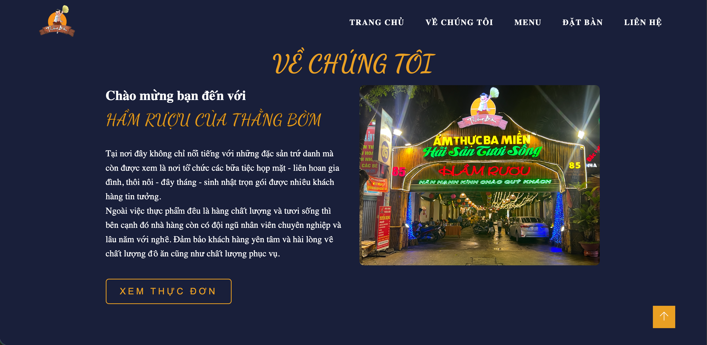
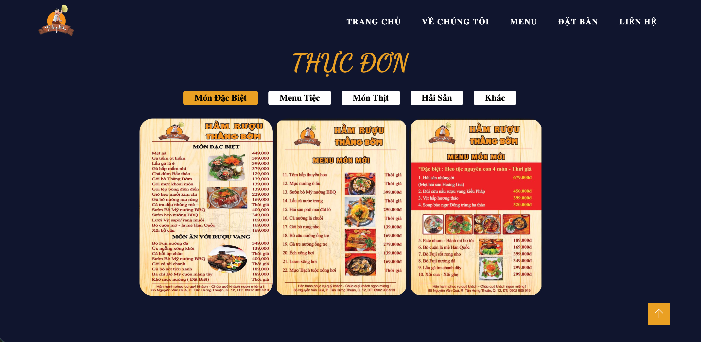
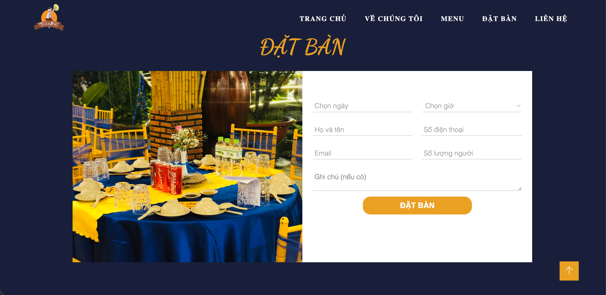
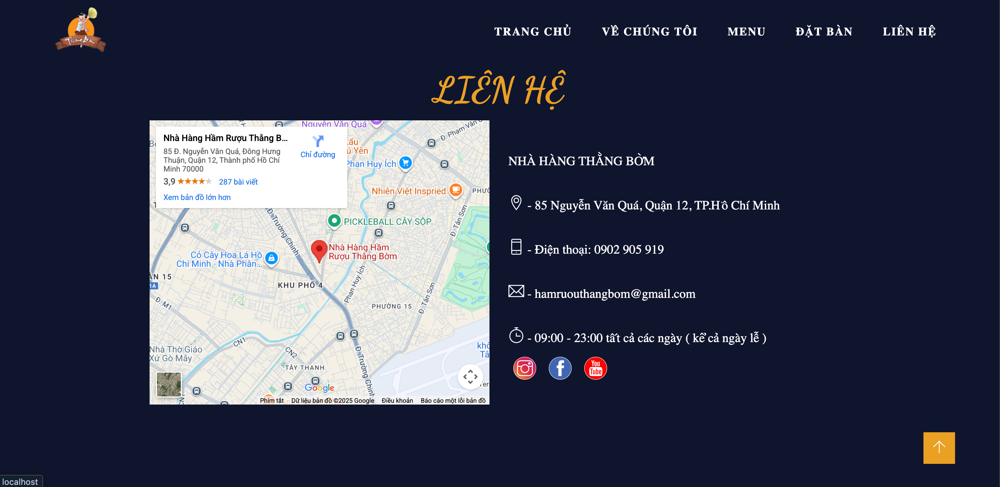
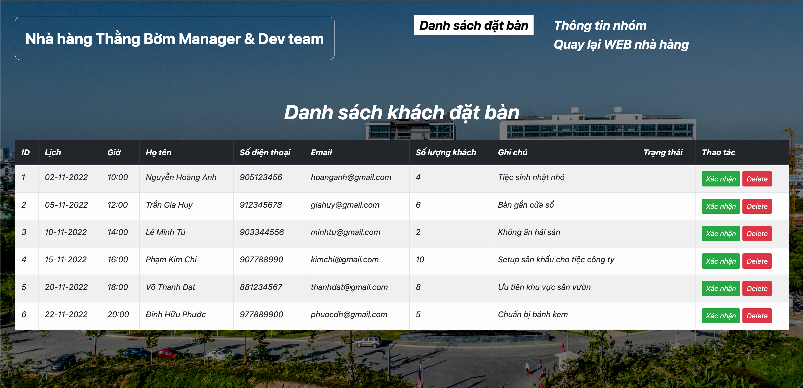

# VLU - ĐẠI HỌC VĂN LANG, TP.HCM

## Môn: Lập trình ứng dụng web

## Đề tài: **Website giới thiệu nhà hàng Thằng Bờm (2022)**

> Đây là phiên bản cũ (2022).  
> Phiên bản ver2 thay đổi giao diện, code sạch hơn:  
> 👉 https://github.com/trgiahuy14/restaurant-html-v2.git

---

## 🔗 Demo:

👉 https://trgiahuy14.github.io/restaurant-html/

---

## Chức năng chính:

- Hiển thị thông tin nhà hàng
- Đặt bàn trực tuyến
- Quản lý thông tin đặt bàn (CRUD dành cho admin)

---

## Technology:

- HTML/CSS
- PHP (kết nối MySQL qua mysqli)

---

## Giao diện:

<h3 align="center">Trang chủ</h3>

<h3 align="center">Về chúng tôi</h3>

<h3 align="center">Menu</h3>

<h3 align="center">Đặt bàn</h3>

<h3 align="center">Liên hệ</h3>

<h3 align="center">Quản lý đặt bàn (Admin)</h3>

<h3 align="center">Thông tin nhóm (Admin)</h3>

---

> Repo này được giữ lại làm tài liệu tham khảo.  
> Toàn bộ cải tiến được thực hiện ở phiên bản mới.
